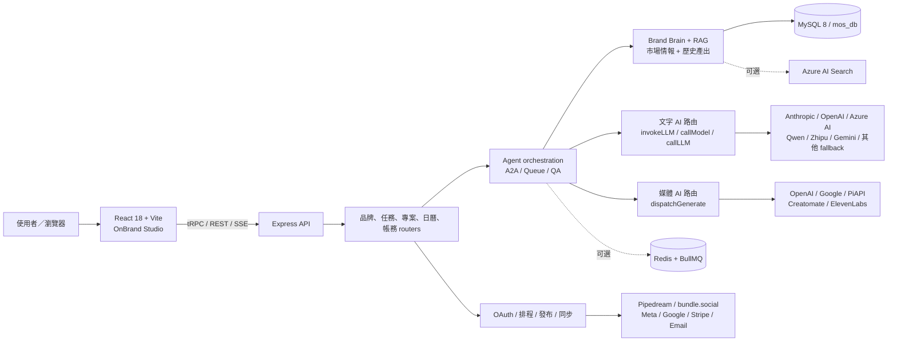

# OnBrand AI

> 永遠 on-brand 的 AI 行銷工作室：把 SoWork 的品牌定位方法寫進 Brand Brain，再由多模型 AI 與專業任務流程，產出、編排並發布一致的跨平台行銷內容。

[單檔專案說明頁](docs/project-overview.html)（GitHub 會顯示原始檔；請下載或由靜態檔案伺服器開啟。）

> 掃描基準：2026-08-10。本文件以目前有被前端、Express 或 tRPC 匯入的程式碼為準；註解、舊文件、未接線原型與需要憑證的整合不視為已上線功能。

## 這個專案在做什麼？

OnBrand AI 是一套從「品牌策略」一路做到「內容執行與發布」的 AI 行銷平台。它不是只有一個聊天框，而是把品牌、產品、活動、受眾、語氣、證據來源與歷史產出組成可重用的 Brand Brain，再交給不同 AI Agent 協作完成任務。

典型使用流程：

1. 建立品牌，輸入網站、社群、產品與活動資料。
2. 執行多步品牌定位研究，整理受眾、競品、差異化、Golden Circle、標語、語氣與品牌資產。
3. 選擇 Facebook、Instagram、LinkedIn、YouTube、TikTok、Email 或 PR 工作區與任務規格。
4. 由策略、研究、文案、視覺與 QA Agent 協作，生成文字、圖片、影片或企劃套組。
5. 在輸出工作區編修、版本化、排程，經由已連線的平台發布。
6. 以 Performance、Market Intel、使用紀錄與品牌知識持續提供下一輪內容的背景資料。

## 功能狀態怎麼讀

| 標記 | 意義 |
| --- | --- |
| **已接通** | 前端有入口，後端路由或服務也已接線；仍可能需要資料與帳號。 |
| **條件式** | 程式已接線，但需要環境變數、第三方憑證、方案權限或 feature flag。 |
| **私人預覽** | 僅 allow-list 帳號可見，部分資料為策展或示範內容。 |
| **原型／歷史** | 留在 repo 供參考，但不是目前主產品入口。 |

## 系統架構



目前真正的應用程式位於 `skills/ai-talent/`：前端入口是 `client/src/main.tsx` → `AppV2`，後端入口是 `server/index.ts`，主要型別安全 API 集中在 `server/routers/index.ts`。

## 功能 × API × AI 對照表

下表的「內部 API」是本 repo 的 tRPC namespace、REST endpoint 或主要 service；「外部 API」是程式碼確實有 adapter、fetch 或 SDK 呼叫的第三方服務。

| 狀態 | 使用者功能與入口 | 主要內部 API／模組 | 外部 API／資料源 | AI／模型路由 |
| --- | --- | --- | --- | --- |
| **已接通** | 公開首頁、定價、條款、隱私、退款：`/`、`/pricing`、`/terms`、`/privacy`、`/refund` | React Router 靜態頁面 | 無必要外部 API | 無 |
| **已接通**＋**條件式** | 註冊、登入、驗證信、忘記密碼、Google 登入、onboarding：`/auth/*`、`/onboarding` | REST `/api/auth`、`brand`、`positioningJobs` | Google OAuth、Resend 或 SendGrid | onboarding 建立品牌後可啟動品牌定位 LLM 管線 |
| **已接通** | 品牌管理與 Brand Brain：`/brands`、`/brands/edit`、`/brands/settings` | `brand`、`brandBrain`、`pipeline`、`positioningJobs`、`workbench`、`brandKnowledge`、`brandColors` | 使用者提供的網站可直接抓取；Browserbase／Playwright、外部搜尋與 Azure AI Search 僅在特定 service／舊任務路徑條件式使用 | `invokeLLM`、`callLLM`、計費版 wrapper；品牌研究、摘要、語氣、標語與 QA 使用多模型 fallback |
| **已接通** | 產品／活動／品牌範圍切換 | `entity`、`product`、`event`、`scope` | 品牌網站與使用者提供資料 | `callLLM`／`invokeLLM` 生成範圍摘要、洞察與定位內容 |
| **已接通** | 平台任務工作區：`/tasks/:platform`，涵蓋 Facebook、Instagram、LinkedIn、YouTube、TikTok、Email、PR | `taskCatalog`、`quickTask`、`squad`、`mission`、`output`、`quickTaskOrchestra` | 任務可選擇帶入網頁搜尋、市場情報與品牌資料 | `callModel` 依任務分類與 Agent 指定模型選路；再由 `invokeLLM` 做跨供應商 fallback；視覺步驟走媒體模型 |
| **原型／條件式** | 舊 A2A endpoint 與下游工作流機制 | REST `/api/a2a/stream`、`executeA2AWorkflow`、`executeTask`、orchestrator workers | Redis／BullMQ 為可選背景佇列 | 各 Agent 可帶自己的 provider/model；但目前 A2A `WORKFLOW_MAP` 沒有註冊 active workflow，不是一般任務的核心路徑 |
| **已接通** | 輸出工作區、版本、編修、定稿、分享、專案：`/run/:outputId`、`/projects` | `output`、`mission`、export routes | Email provider、ICS／檔案下載 | 任務本身的內容生成、修訂與 QA 沿用文字／媒體路由；PDF/PPTX 匯出本身不需要 AI |
| **已接通**＋**條件式** | 圖片生成、視覺方向、prompt 與模型選擇器 | `media`、`image`、`dispatchGenerate` | OpenAI Images、Google Gemini/Imagen、PiAPI、Replicate（去背） | Nano Banana、GPT Image 1、Imagen 4、FLUX Pro／Realism；詳細狀態見下方媒體模型表 |
| **已接通**＋**條件式** | 影片生成與短影音素材 | `media`、`video`、`dispatchGenerate`、`videoService` | Google、PiAPI、ElevenLabs TTS、Creatomate | Veo 3、Kling、Runway、Pika、Hedra；舊的完整影片合成流程受方案／環境限制，腳本段落是固定模板而非 LLM 寫稿 |
| **已接通**＋**條件式** | 圖片、影片、文件轉平台文案：`/media/photo/:channel`、`/media/video/:channel`、`/media/doc` | `mediaCopy` | 影片頁只讀 YouTube public oEmbed；Quick Task 的另一條 YouTube context 才會嘗試 transcript | vision 呼叫會要求 Azure Position Claude Sonnet 4.6；但目前 env schema 未納入該組 Azure keys，若未修正會落到其他可用 LLM |
| **已接通**＋**條件式** | 7-Day Publisher／內容劇場：`/theater`；此流程的渠道是 Facebook、Instagram、YouTube、Threads、LINE、Blog | `theater`：產品發現、排程規劃、cell 生成、QA、圖片、鎖定、排程 | Pipedream／bundle.social 發布 adapter | 文字 LLM 規劃與寫作、第二輪 QA、`dispatchGenerate` 生圖 |
| **已接通**＋**條件式** | 內容日曆、排程、改期、取消與發布：`/calendar` | `calendar`、`publish`、`platformConnect`、`bundleConnect` | 直接 adapter 已接 Facebook、LinkedIn、Instagram；Email／PR 等可走 webhook fallback；YouTube／TikTok direct publish 明確未支援 | 發布本身不需要 AI；改寫或補文案時走 `invokeLLM` |
| **條件式**／**後端 scaffold** | 發布平台連線位於 `/brands/edit?tab=publish`；legacy `/connections` 只會重新導向。雲端專案同步尚無 active UI | `platformConnect`、`bundleConnect`；`projectSync` 僅後端註冊 | Facebook、Instagram、LinkedIn、YouTube、Pipedream、bundle.social；Google Drive、OneDrive、Dropbox 同步尚未接前台 | 無必要 AI；發布連線用於 OAuth／token，雲端資料同步仍待前台接線 |
| **已接通**＋**條件式** | 策略顧問：`/consultant`，五種情境／框架、分析、追問與比稿 | `strategyConsultant` | Tavily 即時研究、Brand Brain | `callModel`，依 Agent 設定使用 Anthropic、Gemini、Qwen 或 Azure AI |
| **私人預覽** | Performance、Market Intel：`/performance*`、`/market-intel*` | `marketIntel`、`perplexityScout` | 實際三個 listening 動作使用 Vertex／Gemini Search／Tavily；Google News／Trends、YouTube Data、Reddit、Ahrefs、Similarweb、SEMrush、Browserbase 等另有 adapter registry，但未找到主流程 caller | Vertex Grounding → Gemini Google Search → Tavily → LLM-only；最後一層不是即時搜尋。其餘儀表板多為預覽資料 |
| **已接通**＋**條件式** | 方案、點數、訂閱、加值、多租戶／workspace | `billing`、`credits`、`stripe`、`tenant` | Stripe Checkout/Webhook、open.er-api.com 匯率 | 帳務本身無 AI；部分任務在呼叫前做方案／點數檢查，部分 LLM 走 `invokeLLMWithBilling` |
| **已接通** | Mia 支援、ticket、管理後台、錯誤／漏斗／成本／健康度：`/admin/*` | `support`、`ops`、`adminStats`、`notifications` | Resend／SendGrid；系統紀錄來自 MySQL | 支援對話與部分錯誤摘要可走 `callModel`／`invokeLLM`；context nudge 的呼叫參數目前不相容，會偏向靜態 fallback；監控查詢本身不需 AI |
| **已接通**／**條件式** | 成就、節慶提醒、changelog；community backend/schema 有保留但前台 marketplace 尚未上線 | `achievements`、`festival`、`community` | 主要為站內資料 | 以規則與內容資料為主；若範本產生內容，仍由任務 LLM 執行 |
| **條件式** | Slack 入口與任務通知 | REST Slack OAuth/events、`notificationService` | Slack API／webhook、OpenClaw gateway、LINE Notify、Telegram Bot | Channel adapter 不直接選模型；轉入任務後由 `executeTask` 的 AI 路由處理 |

## AI 路由：沒有單一固定的「那個 AI」

目前程式中有多個仍在使用的 AI 入口。最後使用哪個模型，取決於呼叫點、任務類型、Agent 設定、環境變數、供應商是否可用與 circuit breaker 狀態。

| 路由層 | 主要用途 | 選模方式 | 主要檔案 |
| --- | --- | --- | --- |
| `invokeLLM` | 通用文字／vision 呼叫與全站 fallback | 若 caller 指定 provider/model 則先嘗試；失敗後依 `LLM_FALLBACK_CHAIN` 或預設鏈切換，略過未設定金鑰或 circuit-open provider | `server/_core/llm.ts` |
| `callModel` | 任務與 Agent 的語意選模 | 先判斷中文內容、創作、分析、分類、即時搜尋、程式或一般任務；也可尊重 Agent 的 preferred provider/model | `server/_core/multiModelRouter.ts` |
| `callLLM` | 定位、catalog、scope、media prompt 等需要短時間跨供應商救援的流程 | Anthropic → Azure Foundry → Azure OpenAI → OpenRouter，受整體時間預算限制 | `server/_core/llmRouter.ts` |
| `invokeLLMWithBilling` | 有包入 token ledger／credits 的 LLM 呼叫 | 先做點數與帳本處理，再交給 `invokeLLM`；目前 ledger 記的是 caller 要求的 model，不一定是 fallback 後真正成功的 model | `server/llmWithBilling.ts` |
| `dispatchGenerate` | 圖像／影片生成 | 依使用者或任務選擇的 media model ID 分派到 OpenAI、Google、PiAPI 等 adapter | `server/_core/mediaGen.ts` |

`invokeLLM` 目前沒有覆寫時的程式順序是 Anthropic → OpenAI → Azure Claude → Azure Foundry → Gemini → Qwen → Zhipu → Ollama；不可達、缺 key 或 circuit-open 的項目會被略過。因 env schema 問題，這不是等同於每一層現在都能真正使用。

### 文字與研究模型

| 供應商／資源 | 程式中的預設或代表模型 | 主要用途與狀態 |
| --- | --- | --- |
| Alibaba Qwen | `qwen-plus` | 中文內容與一般任務常見首選；需 `QWEN_API_KEY` |
| Zhipu | `glm-4-flash` | 分類、一般任務與 fallback；需 `ZHIPU_API_KEY` |
| OpenAI | `gpt-4.1-mini` | 通用文字 fallback；圖片另用 GPT Image 1。目前 `OPENAI_MODEL` 未列 env schema，不能只靠 `.env` 覆寫文字模型 |
| Anthropic direct | `claude-sonnet-4-6`；特定 Agent 可指定 Haiku | 策略、長文、QA；是否優先可由 `LLM_PRIMARY` 調整 |
| Azure AI Foundry | 通用層預設 `gpt-4.1`；任務 router 有自己的 deployment mapping | key 與 endpoint 可用；model override 欄位未列入目前 env schema，調整 deployment 時要同步修 schema／router |
| Azure Position／Azure Claude | `claude-sonnet-4-6`、`claude-haiku-4-5` | 程式有品牌定位、vision、策略與備援 adapter；但相關 env 欄位未列入目前 Zod schema，現況會被 strip，需先修正 schema 才能由 `ENV` 啟用 |
| Azure Northcentral | `DeepSeek-V3.2`，另有 DeepSeek R1／Mistral deployment mapping | 程式有分析、推理與程式任務 adapter；同樣受目前 env schema 缺欄位影響 |
| Google Gemini／Vertex | `gemini-2.5-flash`、Vertex grounding | 通用 fallback、即時 web-grounded research、圖片／影片生成 |
| Cohere | `command-r-plus` | core 中目前屬 deprecated alias，會改走 default provider，不應宣稱請求真的送往 Cohere |
| Hermes／Ollama | self-hosted Hermes、`qwen2.5:7b` 類本機模型 | Hermes env 已在 schema；Ollama customization env 會被 strip，但最後 fallback 仍把固定 `127.0.0.1:11434`／`local` 視為 configured |
| OpenRouter／Forge／Perplexity direct | legacy 或條件式 route | core `invokeLLM` 會把這些 alias 改走 default provider；但獨立的 `callLLM` 會直接讀 `process.env`，OpenRouter 可在該路徑作最後 fallback。Perplexity search 已停用 |

### 圖片與影片模型

模型選擇器的 source of truth 是 `client/src/v2/lib/mediaModels.ts`；server adapter 在 `server/_core/mediaGen.ts`。`Ready` 只代表程式內 registry 與 adapter 已接，不代表本次掃描對供應商做過 live probe。

| 狀態 | 類型 | 模型 |
| --- | --- | --- |
| **Ready** | 圖片 | Google Nano Banana、OpenAI GPT Image 1、Google Imagen 4 Fast／Default／Ultra、PiAPI FLUX Pro／FLUX Realism；目前 `FLUX Pro` 公開 ID 在 adapter 內實際 alias 到 Schnell，屬命名落差 |
| **Ready** | 影片 | Google Veo 3／Veo 3 Fast、PiAPI Kling v2 Master／Kling v1.6 i2v、Runway Gen-4／Turbo、Pika v2、Hedra Character 3 |
| **Manual** | 圖片 | Midjourney v7：沒有 API，系統只提供可複製 prompt |
| **Soon／不可用** | 圖片 | Azure GPT Image 2、Hailuo Image、Ideogram v3、Stable Diffusion 3.5 Large |
| **Soon／不可用** | 影片 | Hailuo i2v／t2v |
| **已移除或未接線** | 媒體 | fal.ai 路徑、Atlas image、Seedance legacy stub；不可當成已上線能力 |

## 外部 API 與服務總表

| 類別 | 外部服務 | 用途 |
| --- | --- | --- |
| 文字／vision AI | Anthropic、OpenAI、Azure AI Foundry／Azure-hosted Claude adapters、Qwen、Zhipu、Google Gemini；另留 Cohere alias | 品牌定位、研究、文案、分析、分類、QA、vision 與 fallback；部分 Azure adapter 受 env schema 阻擋，Cohere alias 不會直送 Cohere |
| 圖片／影片 AI | OpenAI Images、Google Gemini／Imagen／Veo、PiAPI、Replicate、ElevenLabs、Creatomate | 生圖、生影片、去背、TTS 與影片合成 |
| RAG／即時研究 | Azure AI Search query、Gemini Vertex grounding、Gemini Google Search、Tavily | 舊任務 RAG 查詢、背景定位／brief／listening 的 best-effort live research；失敗可能退到非即時模型知識 |
| 社群連線／發布 | Pipedream Connect、bundle.social、Meta Graph API | OAuth、排程與跨平台發布 |
| 專案同步（後端 scaffold） | Pipedream workflow、Google Drive、OneDrive、Dropbox、Facebook、Instagram、YouTube | 後端 route／adapter 已註冊，但目前沒有 active 前端入口，不應視為已上線功能 |
| 身分／通知 | Google OAuth、Resend、SendGrid、Slack、LINE Notify、Telegram Bot | 登入、驗證信、重設密碼、入口與任務通知 |
| 商務 | Stripe、open.er-api.com | 訂閱、加值、webhook、USD/TWD 匯率 |
| 內容來源 | YouTube oEmbed／Quick Task transcript；Google News／Trends、Reddit、Ahrefs、Similarweb、SEMrush 等 adapters | YouTube 有 active caller；後一組 scout adapters 未找到 `runScouts` 主流程 caller，屬 scaffold 而非已上線資料源 |

## 品牌定位與 Brand Brain 的兩條實際流程

目前存在兩條有接線但用途不同的定位流程：

- 前台互動研究管線：由 `BrandsPage` 與 `positioningPipeline.ts` 驅動，逐步研究並讓使用者審閱／鎖定；公開頁以「14 步品牌定位」描述這段體驗。
- 背景 canonical runner：`positioningJobs` 會依 scope 執行固定 segments。品牌背景流程目前是 10 個 canonical segments；產品與活動各有自己的 segment 組合。

因此不應把所有定位工作都寫成同一個固定步數。兩條流程最後都會把可用結果寫回品牌資料，讓任務 prompt、顧問、日曆與內容劇場共用。

另需注意：互動 pipeline 的註解與 prompt 曾宣稱透過 OpenClaw `web_search` 研究，但目前 `pipeline.runStep` 實際呼叫的 `callLLM` 沒有掛 tools。使用者提供的 URL 可以直接抓取；不能把每一步都描述成有即時網搜或已驗證來源。

## 頁面地圖

| 區域 | 路由 |
| --- | --- |
| 公開／帳號 | `/`、`/pricing`、`/terms`、`/privacy`、`/refund`、`/auth/*`、`/onboarding` |
| 內容工作 | `/tasks/:platform`、`/run/:outputId`、`/projects`、`/theater`、`/calendar` |
| 品牌與整合 | `/brands`、`/brands/edit`、`/brands/settings`；`/connections` 僅為 legacy redirect |
| 洞察與顧問 | `/consultant`、`/performance*`、`/market-intel*` |
| 個人／workspace | `/settings/account`、`/settings/workspace`、`/achievements`、`/changelog` |
| 媒體轉文案 | `/media/photo/:channel`、`/media/video/:channel`、`/media/doc` |
| 管理後台 | `/admin/dashboard`、`/admin/errors`、`/admin/activation`、`/admin/user/:id`、`/admin/support`、`/admin/squads` |

## Repo 結構

```text
onbrand/
├── skills/ai-talent/           # 目前主產品
│   ├── client/                 # React 18 / Vite 前端；src/main.tsx → AppV2
│   ├── server/                 # Express、tRPC、Agent、LLM/media adapters
│   ├── drizzle/                # MySQL schema 與 migrations
│   ├── data/                   # Agent assignment、media prompt 等資料
│   └── scripts/                # seed、audit、migration、provider probe
├── skills/brand-engine/        # 相容 shim；主要實作已回到 ai-talent/server/brand
├── skills/market-intel/        # 可被任務動態載入的市場資料查詢模組
├── skills/enterprise-tenant/   # 模組描述；實際 tenant/billing router 在 ai-talent
├── skills/slogan-skills/       # slogan squad seed／資料腳本
├── skills/mobile/              # 獨立 mobile 原型，不是目前主入口
├── shared/                     # 共用 globalization utilities
├── tests/e2e/                  # Playwright E2E
├── docs/                       # 架構、稽核、migration 與本說明頁
├── onbrand-onepager/           # 尚未改造的 Vite starter，不是產品網站
└── README.md                   # 本文件
```

## 技術棧

- Runtime：Node.js 22+、TypeScript、tsx
- Frontend：React 18、Vite 5、React Router 6、TanStack Query、tRPC client、Tailwind CSS 3、HeroUI、Framer Motion
- Backend：Express 4、tRPC 11、Zod、JWT（jose）、BullMQ／Redis（可選）
- Database：MySQL 8、Drizzle ORM；本機 primary schema 預設為 `mos_db`
- Search／RAG：Azure AI Search（可選）
- Export：PDFKit、python-pptx、Sharp、html2canvas
- Deployment artifacts：PM2、Nginx、Azure VM 相關設定與腳本

## 本地開發

根目錄的舊 `package.json` scripts 仍指向不存在的路徑；目前請從 `skills/ai-talent/` 啟動。

### 需求

- Node.js 22+
- MySQL 8，可連線到 `mos_db` 或相容 schema
- 至少一組可用文字 LLM 金鑰，才可執行 AI 任務

### 最小必要環境變數

在 `skills/ai-talent/.env` 建立設定。不要提交真實 secret。

```dotenv
NODE_ENV=development
PORT=3101
JWT_SECRET=<至少 32 字元的隨機字串>

LOCAL_DB_HOST=localhost
LOCAL_DB_USER=mos_user
LOCAL_DB_PASSWORD=<資料庫密碼>
LOCAL_DB_NAME=mos_db

# 至少配置一個可用 provider，例如：
QWEN_API_KEY=<api-key>

# 讓前端登入／驗證信 URL 指向正確位置
APP_URL=http://localhost:5173
```

### 安裝與啟動

```bash
cd skills/ai-talent
npm install

cd client
npm install
cd ..
```

終端機 1：

```bash
cd skills/ai-talent
npm run dev
```

終端機 2：

```bash
cd skills/ai-talent/client
npm run dev
```

- Backend：`http://localhost:3101`
- Frontend：`http://localhost:5173`，Vite 會代理 API 到 backend

### Build 與測試

```bash
# server typecheck
cd skills/ai-talent
npm run build

# server tests
npm test

# client production build
cd client
npm run build

# E2E（需要先準備可測站台與對應 env）
cd ../../../tests/e2e
npm install
npx playwright test
```

## 常用環境變數群組

完整可用 keys 以 `skills/ai-talent/server/_core/env.ts` 與各 adapter 的 runtime 檢查為準。根 `.env.example` 的命名與覆蓋範圍已落後，不能直接當成完整 source of truth。

| 能力 | 代表環境變數 |
| --- | --- |
| 文字 AI | `ANTHROPIC_API_KEY`、`OPENAI_API_KEY`、`QWEN_API_KEY`、`ZHIPU_API_KEY`、`GOOGLE_AI_API_KEY`、`AZURE_FOUNDRY_*`；其他 Azure／Gemini alias 要先同步補進 env schema |
| AI 路由 | `LLM_PRIMARY`、`LLM_FALLBACK_CHAIN`、各 provider model override |
| 媒體 AI | `PIAPI_KEY`、`OPENAI_API_KEY`、`GEMINI_API_KEY`、`ELEVENLABS_API_KEY`、`CREATOMATE_API_KEY` |
| RAG／研究 | `AZURE_SEARCH_*`、`TAVILY_API_KEY`、搜尋與 scout 個別 keys |
| 發布 | `SOCIAL_PUBLISH_ENABLED`、`PUBLISH_PROVIDER`、`PUBLISH_PROVIDER_<PLATFORM>`、Pipedream／bundle.social credentials |
| Queue | `REDIS_URL` 與 background worker feature flags |
| Auth／Email | `JWT_SECRET`、`GOOGLE_CLIENT_ID`、`GOOGLE_CLIENT_SECRET`、`RESEND_API_KEY`、`SENDGRID_API_KEY`、`EMAIL_FROM`、`APP_URL` |
| Billing | Stripe secret／price／webhook keys，以及方案設定 |

## 已知限制與技術債

- `Performance`／`Market Intel` 目前是私人預覽；只有部分 listening 任務接即時研究，其餘卡片不可當作完整資料管線已上線。
- 文字 AI 有 `invokeLLM`、`callModel`、`callLLM` 與計費 wrapper 多個入口。不是所有 LLM 呼叫都經 `invokeLLMWithBilling`；若要保證統一成本治理，需要後續收斂與稽核。
- `env.ts` 的 Zod object 會移除未宣告欄位；透過 `ENV as any` 讀取的部分 Azure keys、Gemini／Ollama override 與 model override 因此會是 `undefined`。直接讀取 `process.env` 的 media／scout 路徑與固定 localhost 的 Ollama fallback 不受此限制，不能把單一路徑的缺口解讀為整個 provider 都不可用。
- Azure Foundry 的 model mapping 分散在通用 router 與 task router，deployment 名稱可能由 env 覆寫；調整模型時應同時檢查兩處。
- OAuth、發布、同步、RAG、Queue、Email、Stripe 與多數 scout 沒有憑證就會關閉或失敗，不能只看 UI 判定為可用。
- Google News／Trends、Reddit、Ahrefs、Similarweb、SEMrush、Browserbase，以及 Serper／Brave／DuckDuckGo 等 adapter／tool 雖存在，未找到目前 UI 主流程 caller；除非重新接線，不應列為 active integrations。
- 媒體選擇器明確區分 Ready／Manual／Soon；fal.ai、Atlas image 等歷史 adapter 不代表可用能力。
- 舊 `videoRouter` 的完整合成服務受方案與環境限制；新的 media picker 可用模型不等於長影片 workflow 全部可用。
- 舊 `videoService` 的腳本由固定場景模板組成，不是 LLM 寫稿；缺少 ElevenLabs／Creatomate keys 時只會回傳第一段生成影片。
- Azure AI Search 目前可在舊 `executeTask` 路徑做查詢，但 repo 內沒有已接線的自動 index／delete 呼叫；不要宣稱上傳資料就會自動進 RAG。
- `skills/market-intel/server/marketIntel.ts` 是查詢舊 MySQL `sowork_db.market_data`／`creative_cases` 快取的 legacy service；它不等同私人預覽頁的即時 listening route。
- A2A SSE endpoint 雖仍掛載，但 active workflow map 目前為空；一般 Web 任務的主流程是 `quickTaskRouter` + `quickTaskOrchestra`。
- `/health` 的 provider 判定與 core router 使用的 env 名稱不完全一致，可能對 Google 產生 false negative、對未接 core provider 的 key 產生 false positive；不能把 health response 當完整模型支援清單。
- client 的 GA4、Meta Pixel、Microsoft Clarity ID 仍是 placeholder；目前不可宣稱 analytics 已啟用。
- 安全性事件、憑證輪替與弱點位置應只記錄於私人 security issue；公開文件僅保留一般性安全政策。
- 根 README、根 scripts 與部分 `docs/` 曾長期落後；未來應以 active import、route、runtime guard 與測試為 source of truth。
- `onbrand-onepager/` 仍是 Vite starter；`skills/mobile/` 是原型。兩者都不是目前 OnBrand Studio 的 production entry。

## 延伸文件

- [視覺化專案說明](docs/project-overview.html)
- [架構設計](docs/ARCHITECTURE.md)
- [Token 與點數計費](docs/TOKEN-BILLING.md)
- [測試指南](TESTING.md)
- [貢獻指南](CONTRIBUTING.md)
- [維護指南](MAINTENANCE.md)
- [2026-05-10 稽核快照](docs/audit-2026-05-10.md)

---

OnBrand AI 是產品名稱；SoWork 是營運與方法論來源。OpenClaw／Slack gateway 仍是可選整合，不再是整個 Web 產品的唯一入口。
